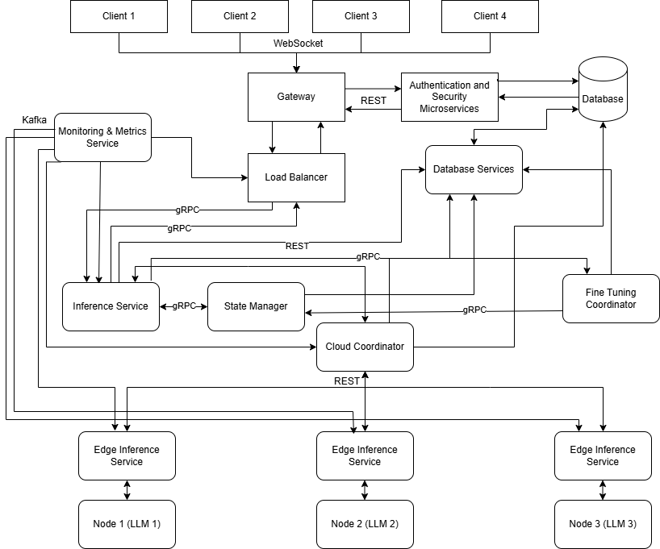

# 🌍 Geo-Distributed Large Language Model (LLM) Serving & Fine-Tuning Platform

[](LICENSE)
[](https://www.python.org/)
[](https://kubernetes.io/)
[](https://grpc.io/)
[](https://pytorch.org/)
[](https://huggingface.co/)

##  Overview

### **What is this project?**
This project builds a **Geo-Distributed LLM Serving & Fine-Tuning Platform**, where a **large language model (LLM)** is distributed across multiple geographically separated nodes. Each node **stores and fine-tunes part of the model**, while ensuring **efficient inference, training synchronization, and scalability** using **CRDTs (Conflict-Free Replicated Data Types)**.

### **Why is this important?**
- 🏗 **Decentralized LLM Deployment:** Avoids central cloud dependency.
- ⚡ **Efficient Distributed Training:** Fine-tuning updates are **merged conflict-free** across locations.
- 🌐 **Geo-Optimized Inference:** Queries **route to the nearest node** for reduced latency.
- 🛡 **Fault-Tolerant & Scalable:** Ensures **model serving continuity** during failures.

---

##  **Key Features**
1 **Single-Node LLM Inference Server** - A base model for inference.  
2 **Geo-Distributed Multi-Node Communication** - RPC/gRPC for inference request routing.  
3 **Logical Clocks & Consensus** - Tracks updates via Lamport timestamps.  
4 **Conflict-Free Model Updates (CRDTs)** - Efficient fine-tuning synchronization.  
5 **Auto-Scaling** - Kubernetes-based dynamic workload balancing.  
6 **Smart Query Routing & Scheduling** - Routes requests to underloaded nodes.  
7 **Edge–Cloud Synchronization** - Deploys LLM inference at the **edge** and syncs updates.  
8 **Multi-Cloud Deployment** - Simulates a **real-world geo-distributed system**.  
9 **Big Data Integration** - Partial fine-tuning with **large domain-specific datasets**.  
10 **Security & Monitoring** - Implements **OAuth2 authentication, logging, and performance monitoring**.  

---

## ⚙️ **System Architecture**
###  High-Level Design
The system follows a **microservices-based architecture**, consisting of:

1️⃣ **LLM Inference & Fine-Tuning Nodes** (Distributed Workers)  
2️⃣ **gRPC-Based Communication Layer** (Inter-node messaging)  
3️⃣ **CRDT-Based Synchronization Module** (For conflict-free fine-tuning)  
4️⃣ **Auto-Scaler & Load Balancer** (Optimizes inference requests)  
5️⃣ **Edge Nodes for Low-Latency Inference** (Synchronizing with cloud)  
6️⃣ **Multi-Cloud Deployment Framework** (Cross-region model replication)

### **🔹 Technical Stack**
| **Component**    | **Technology Used** |
|-----------------|--------------------|
| LLM Backend    | [Hugging Face Transformers](https://huggingface.co/), PyTorch |
| gRPC Framework | gRPC (Protocol Buffers) |
| Model Updates  | CRDTs (Conflict-Free Replicated Data Types) |
| Auto-Scaling   | Kubernetes + Horizontal Pod Autoscaler |
| Load Balancing | Consistent Hashing, K8s Service Mesh |
| Monitoring     | Prometheus + Grafana |
| Authentication | OAuth2.0, JWT |
| Deployment     | Kubernetes (AWS, GCP, Azure) |
| Big Data Processing | Apache Spark, Ray |
| Edge Inference | TensorRT, ONNX Runtime |

---

##  **Installation & Deployment**
### **🔹 Prerequisites**
Before setting up the project, install the following dependencies:
- **Python 3.9+**
- **Docker & Kubernetes**
- **gRPC & Protocol Buffers**
- **Hugging Face Transformers**
- **PyTorch**
- **Prometheus & Grafana**
- **Cloud CLI Tools (AWS, GCP, Azure)**

### Step 1: Clone the Repository
```sh
  git clone https://github.com/your-username/geo-distributed-llm.git
  cd geo-distributed-llm 
```
### Step 2: Setup Virtual Environment
```sh
  python3 -m venv venv
  source venv/bin/activate
  pip install -r requirements.txt

```
### Step 3: Start Single-Node Inference Server
```sh
 python3 src/inference_server.py
```
### Step 4: Deploy Multi-Node System on Kubernetes
```sh
kubectl apply -f k8s/deployment.yaml
```
### Step 5: Run Load Tests
```sh
python3 tests/load_test.py
```

##  API Endpoints

### LLM Inference API

| Method | Endpoint    | Description                  |
|--------|------------|------------------------------|
| POST   | `/predict`  | Submit an inference request  |
| POST   | `/fine-tune` | Submit a fine-tuning request |
| GET    | `/status`   | Check system health         |


## Example API Call
```sh
  curl -X POST http://localhost:5000/predict -H "Content-Type: application/json" -d '{"text": "Explain quantum computing"}'
```


